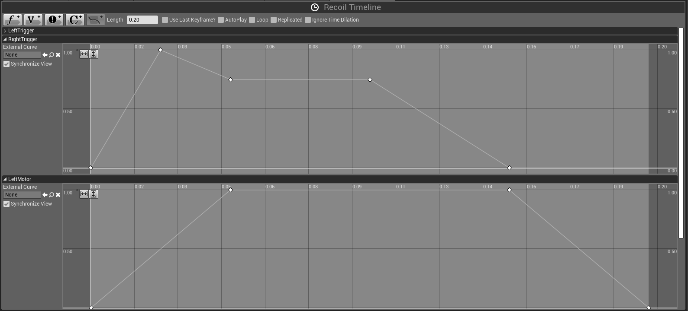

# UE4 Windows.Gaming.Input Plugin

[Windows.Gaming.Input API](https://docs.microsoft.com/en-us/uwp/api/windows.gaming.input) (or Windows.Gaming.Input) is a Windows 10 specific API, which has better support for Xbox One controllers, including impulse triggers.

I'm planning for this plugin to make full use of the Windows.Gaming.API, but so far, **this plugin only supports the impulse trigger feature**.

The reason is that I lack knowledge to make a proper Input Device plugin for UE4, so if you want to help, feel free to do so.

I'm also not sure how this plugin behaves on versions of Windows older than Windows 10, so report any issues you find.

**Windows.Gaming.Input API requires Windows 10 to work.**

### Installation

Just copy the folder into your project Plugins folder.

### Buidling

You can't build a plugin directly, you'll need to create a host project first (any project using c++ code).

### Usage

This plugin only supports gamepad output in form of vibrations. There is currently no support for built-in force feedback, so you need to use timelines.

Example usage:

This project has adopted the [Microsoft Open Source Code of
Conduct](https://opensource.microsoft.com/codeofconduct/).
For more information see the [Code of Conduct
FAQ](https://opensource.microsoft.com/codeofconduct/faq/) or
contact [opencode@microsoft.com](mailto:opencode@microsoft.com)
with any additional questions or comments.
